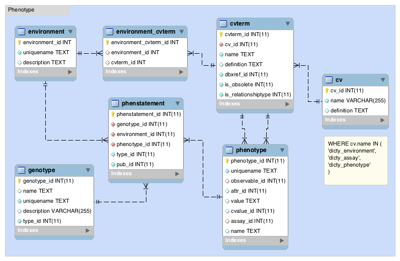

## Why stock-data?
The **Dicty Stock Center** is a central repository for _Dictyostelium discoideum_ strains, isolates of other cellular slime mold species, plasmids, and commonly used bacteria. These growing collections have to be searched through catalogs which have to be continuously updated. The strain collection includes:
- strain catalog
- natural isolates
- MNNG chemical mutants
- tester strains for parasexual genetics
- auxotroph strains
- null mutants
- GFP-labeled strains for cell biology
- plasmid catalog

All this information has to be available through the dictybase. Under the current schema, there are a few tables directly related to the stock center. The tables and respective columns are:

- stock_center = id, strain_name, strain_description, strain_comments, created_by, pubmedid, obtained_on, species, date_created, other_references, genotype, systematic_name, phenotype, plasmid, dbxref_id, obtained_from, obtained_as, mutant_type, strain_verification, internal_db_id, mutagenesis_method, genotype_id, strain_type, parental_strain, date_modified, is_available.e.
- stock_center_inventory = id, strain_id, created_by, date_created, viability_test_results, date_modified, date_transferrrd_to_ln, obtained_as, no_of_vials, stored_as, location, date_of_strain_plating, plating_results, stored_by, viability_test_performed_by, date_of_viability_test, other_comments_and_feedback, storage_date, stored_from, strain_verification, color, storage_comments
- stock_item_order = stock_item_order_id, item_id, order_id, item
- stock_order = stock_order_id, colleague_id, order_datete

CHADO includes several stock-related tables:

- stock
- stock_cvterm
- stock_dbxref
- stock_genotype
- stock_pub
- stock_relationship
- stock_relationship_pub
- stockcollection
- stockcollection_stock
- stockcollectionprop
- stockprop
- stockprop_pub

**The scope of the project is to import the stock data available from the Oracle database into the CHADO schema. Therefore, a basic understanding of the principles behind the CHADO schema is mandatory.**

CHADO has a module designed to store information about stock collections in a laboratory. As it is described in the stock module gmod wiki...

> "There is a lot in common between a Drosophila stock and a Saccharomyces strain and an Arabidopsis line. They all come from some taxon, have genotypes, physical locations in the lab, some conceivable relationship with a publication, some conceivable relationship with a sequence feature (such as a transgene), and could be described by some ontology term. 

> **It may be that not all critical details about your collection are accomodated, if this is the case it should not be difficult to extend for your own purposes**

**Therefore, the goals should be, not only to import our stock data into this module, but also to identify what it is necessary to accommodate the Dicty Stock Center needs and implement the corresponding modifications to the chado stock module.**

## What tasks remain to be finished?

* Review the Data Model

## Data Model
Data Model (SQL) to import stock data (strain, plasmid). 

* [This document](https://github.com/dictyBase/Migration-Docs/blob/master/stock-data-migration/import.md) contains discussions about the data model. 
* [This other document also contains discussions](https://github.com/dictyBase/Migration-Docs/blob/master/stock-data-migration/discussions.md#stock-data-import-discussions) for both import and export stock data.

### Import strain data

####  Phenotype data model
   * The observation from expression of genotype is phenotype. Attributes observed can be affected by the environment
      * `genotype -> phenotype <- environment`
	  * [`uniquename` should be a unique identifier (randomly generated)](https://github.com/dictyBase/Modware-Loader/issues/80)
   * Phenotype notes 
      * Look-up `phenotypeprop` table from Chado svn
      * `attr_id` - Look for something in PATO or OBO foundry that can nicely explain a note
	  * `value` - This will be the phenotype note for the above `attr_id (cvterm_id)`
   * `dicty_environment` ontology will be loaded in `Cv::Cvterm`. However, which ever environment terms are associated with phenotype will also be duplicated in the `environment` table.
   * `dicty_assay` ontology is loaded in `Cv::Cvterm` and used in `Phenotype::Phenotype`. `dicty_assay` has nothing to do with `Mage::Assay`.  
   

### Import plasmid data

* Plasmid map images
   * ~~Get images from existing files~~
   * Data goes to `stockprop` with `type_id` as `plasmid map` (maybe).
   * ~~Image saved as binary blob~~
   

## Deferred 
(by Yogesh)

1. ~~GenBank/FastA sequence imports for plasmids & plasmid-gene link~~ [`#106`](https://github.com/dictyBase/Modware-Loader/pull/106)
2. Strain-gene link
