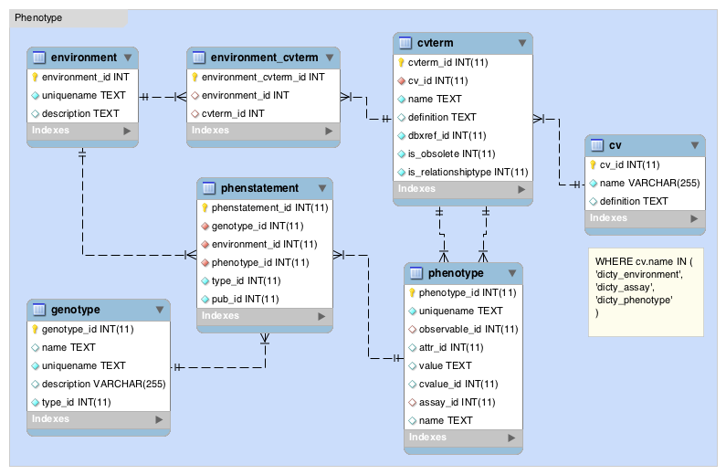

## Stock data import
## Description of the project
Let's see if this work, because I don't believe, I need to see.

### Synopsis

```perl
modware-import dictyplasmid2chado -c plasmid_import.yaml 
modware-import dictyplasmid2chado -c plasmid_import.yaml --mock_pubs --prune 
modware-import dictyplasmid2chado -c plasmid_import.yaml --data inventory --data props # For specific imports 
modware-import dictyplasmid2chado -c plasmid_import.yaml --seq_data_dir <path-to-folder> # Path tol folder with GanBank/FastA sequences

modware-import dictystrain2chado -c strain_import.yaml 
modware-import dictystrain2chado -c strain_import.yaml --prune --mock_pubs # Options to prune or mock publications 
modware-import dictystrain2chado -c strain_import.yaml --data inventory --data genotype # For specific imports 
modware-import dictystrain2chado -c strain_import.yaml --dsc_phenotypes <path-to-file> # Path to file with corrected DSC phenotypes 
```

#### Deferred

1. ~~GenBank/FastA sequence imports for plasmids & plasmid-gene link~~ [`#106`](https://github.com/dictyBase/Modware-Loader/pull/106)
2. Strain-gene link

### [Data Model](https://github.com/dictyBase/Migration-Docs/blob/master/stock-data-migration/import.md)
### [Discussions](https://github.com/dictyBase/Migration-Docs/blob/master/stock-data-migration/discussions.md#stock-data-import-discussions)
### Import strain data

####  Phenotype data model
   * The observation from expression of genotype is phenotype. Attributes observed can be affected by the environment
      * `genotype -> phenotype <- environment`
	  * [`uniquename` should be a unique identifier (randomly generated)](https://github.com/dictyBase/Modware-Loader/issues/80)
   * Phenotype notes 
      * Look-up `phenotypeprop` table from Chado svn
      * `attr_id` - Look for something in PATO or OBO foundry that can nicely explain a note
	  * `value` - This will be the phenotype note for the above `attr_id (cvterm_id)`
   * `dicty_environment` ontology will be loaded in `Cv::Cvterm`. However, which ever environment terms are associated with phenotype will also be duplicated in the `environment` table.
   * `dicty_assay` ontology is loaded in `Cv::Cvterm` and used in `Phenotype::Phenotype`. `dicty_assay` has nothing to do with `Mage::Assay`.  
   

### Import plasmid data

* Plasmid map images
   * ~~Get images from existing files~~
   * Data goes to `stockprop` with `type_id` as `plasmid map` (maybe).
   * ~~Image saved as binary blob~~
