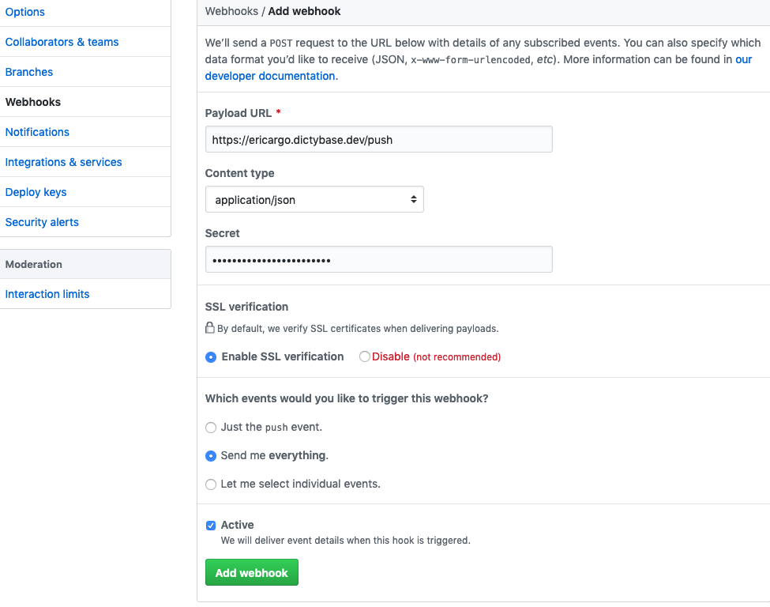

# Argo Events

Here we will go through the process of setting up Argo Events with a GitHub 
webhook in your cluster.

## Initial Setup

Make sure your account has the ability to create new clusterroles. See the 
[arangodb](./arangodb.md) guide for more information. Also the official Argo 
Events documentation can be found [here](https://argoproj.github.io/argo-events/).

### Install Helm Charts

- First create namespaces


> `$_> kubectl create namespace argo`


> `$_> kubectl create namespace argo-events`

- Add `argoproj` repository


> `$_> helm repo add argo https://argoproj.github.io/argo-helm`

- Install `argo` chart


> `$_> helm install argo/argo --namespace argo`

- Install `argo-events` chart


> `$_> helm install argo/argo-events --namespace argo-events`

### Generate Issuer and Certificate

You will need to create a new issuer and certificate -- these are required in 
order to set up Ingress (our next step). Make sure you have `cert-manager` set 
up per [these instructions](./certificate.md).

__Issuer__
```yaml
apiVersion: certmanager.k8s.io/v1alpha1
kind: Issuer
metadata:
  name: argo-eric-dev
  namespace: argo-events
spec:
  acme:
    # The ACME server URL
    server: https://acme-v02.api.letsencrypt.org/directory
    # Email address used for ACME registration
    email: YOUR EMAIL HERE....
    # Name of a secret used to store the ACME account private key
    privateKeySecretRef:
      name: argo-eric-dev
    # Enable the HTTP-01 challenge provider
    http01: {}
```


> `$_> kubectl apply -f issuer.yml`

****
__Certificate__
```yaml
apiVersion: certmanager.k8s.io/v1alpha1
kind: Certificate
metadata:
  name: dictyargo-eric-dev
  namespace: argo-events
spec:
  secretName: argo-eric-dev-tls
  issuerRef:
    kind: Issuer
    name: argo-eric-dev
  dnsNames:
    - ericargo.dictybase.dev
  acme:
    config:
      - http01:
          ingressClass: nginx
        domains:
          - ericargo.dictybase.dev
```


> `$_> kubectl apply -f certificate.yaml`


### Enable Ingress

Ingress is necessary in order to get the service URL that exposes the gateway 
server and makes it reachable from GitHub.

- Make ingress yaml file (`ingress-gh.yaml`)

```yaml
apiVersion: extensions/v1beta1
kind: Ingress
metadata:
  annotations:
    kubernetes.io/ingress.class: nginx
  name: github-gateway-svc
  namespace: argo-events
spec:
  rules:
  - host: ericargo.dictybase.dev
    http:
      paths:
      - backend:
          serviceName: github-gateway-svc
          servicePort: 12000
        path: /github
  tls:
  - hosts:
    - ericargo.dictybase.dev
    secretName: argo-eric-dev-tls
```


>`$_> kubectl apply -f ingress-gh.yaml -n argo-events`

### Enable GitHub Webhooks

Go to the GitHub repository of the project you want to use webhooks on, then 
click the Settings tab. In here, click on the Webhooks tab and then "Add webhook".

Here is an example of what your settings could look like.



Make sure content type is `application/json`.

You have to create the secret yourself. A helpful way to generate a new one is 
by using this command in the terminal: 

`ruby -rsecurerandom -e 'puts SecureRandom.hex(20)'`

**Important:** Make note of this secret key -- you will need it shortly.

**Also** make note of the webhook ID. You can find this by clicking on the webhook 
once it has been created (it will be found at the end of the URL (i.e. `117799556`)). 
This is required for use in the event source config later on.

### Generate GitHub personal access token (apiToken)

Now you need to generate a personal access token from GitHub. Go to your  
[personal settings page](https://github.com/settings/tokens). Click "Generate 
new token" then fill out the Note and select your desired scopes. Once complete, 
click "Generate token" at the bottom. **IMPORTANT: copy this token immediately.** 
You will need this for the next section.

### Generate Kubernetes secret

You need to create a [Kubernetes secret](https://kubernetes.io/docs/concepts/configuration/secret/) 
with both your webhook secret and personal access token. It is preferable to 
generate this via the command line. I ran into issues when using a YAML file 
where somehow foreign characters were being passed in, thereby creating 
verification problems.


>`$_> kubectl create secret generic github-access --from-literal=apiToken=YOUR_TOKEN_HERE `
>                        `--from-literal=webHookSecret=YOUR_SECRET_HERE -n argo-events`

## Argo Events Deployment Process

Three pieces are required for Argo Events and they need to be deployed in this 
exact order.

### Deploy the gateway

A gateway consumes events from event sources, transforms them into the 
[cloudevents specification](https://github.com/cloudevents/spec) compliant events 
and dispatches them to sensors.

One gateway can have multiple sensors, as denoted by the `watchers` key at the 
bottom of the config file.

The [official documentation](https://argoproj.github.io/argo-events/gateway/) has 
a diagram that shows the process from client to server.

- Create a new yaml file (`github-gateway.yaml`).

```yaml
apiVersion: argoproj.io/v1alpha1
kind: Gateway
metadata:
  name: github-gateway
  labels:
    # gateway controller with instanceId "argo-events" will process this gateway
    gateways.argoproj.io/gateway-controller-instanceid: argo-events
    # gateway controller will use this label to match with its own version
    # do not remove
    argo-events-gateway-version: v0.10
spec:
  type: "github"
  eventSource: "github-event-source"
  processorPort: "9330"
  eventProtocol:
    type: "HTTP"
    http:
      port: "9300"
  template:
    metadata:
      name: "github-gateway"
      labels:
        gateway-name: "github-gateway"
    spec:
      containers:
        - name: "gateway-client"
          image: "argoproj/gateway-client"
          imagePullPolicy: "Always"
          command: ["/bin/gateway-client"]
        - name: "github-events"
          image: "argoproj/github-gateway"
          imagePullPolicy: "Always"
          command: ["/bin/github-gateway"]
      serviceAccountName: "argo-events-sa"
  service:
    metadata:
      name: github-gateway-svc
    spec:
      selector:
        gateway-name: "github-gateway"
      ports:
        - port: 12000
          targetPort: 12000
      type: LoadBalancer
  watchers:
    sensors:
      - name: "github-sensor"
```


>`$_> kubectl apply -f github-gateway.yaml -n argo-events`

### Deploy the event source

Event sources are config maps that are interpreted by the gateway as a source 
for events producing the entity.

In this file, you will need to specify the webhook ID, GitHub repository, the 
actual hook endpoint/port and the tokens from your K8s secret.

You can include multiple events in the same config file. In the below example, 
we have one event named `example`. You can easily add another by adding a new 
key under `data`, the same way that `example` is listed.

- Create a new yaml file (`github-event-source.yaml`).

```yaml
apiVersion: v1
kind: ConfigMap
metadata:
  name: github-event-source
  labels:
    # do not remove
    argo-events-event-source-version: v0.10
data:
  example: |-
    # ID of the GitHub webhook
    # this needs to match the one you generated
    id: 123
    owner: "dictybase"
    repository: "test-repo"
    # Github will send events to the following port and endpoint
    hook:
     endpoint: "/github/push"
     port: "12000"
     # url the gateway will use to register at GitHub
     url: "https://ericargo.dictybase.dev"
    # type of events to listen to
    events:
    - "*"
    # apiToken refers to K8s secret that stores the github personal access token
    apiToken:
      # Name of the K8s secret that contains the access token
      name: github-access
      # Corresponding key in the K8s secret
      key: apiToken
    # webHookSecret refers to K8s secret that stores the webhook secret
    webHookSecret:
      name: github-access
      key: webHookSecret
    # type of connection between gateway and github
    insecure: false
    # determines if notifications are sent when the webhook is triggered
    active: true
    contentType: "json"
```


>`$_> kubectl apply -f github-event-source.yaml -n argo-events`

### Deploy the sensor

Sensors define a set of event dependencies (inputs) and triggers (outputs). 

An event dependency is the event the sensor is waiting for. It is defined as 
"gateway-name:event-source-name". Based on the config file we used for the event 
source, our dependency would be `github-gateway:example`.

Triggers are executed once the event dependencies are resolved.

Each sensor can have multiple events defined. The [documentation](https://argoproj.github.io/argo-events/sensor/) 
has a nice diagram showing the workflow.

The following example is very simple. We have set up a URL trigger that uses 
a [YAML config file](https://gist.githubusercontent.com/wildlifehexagon/6af9db7a0537b3e40962cb34adbb5edd/raw/63965625fecc821e5144e035bfe503ff57877910/gh-test.yaml) 
which in turn points to a Docker container. An environmental variable is passed 
to the Dockerfile with the contents of our webhook JSON response. The only 
purpose of this Dockerfile is to print the JSON to the console, but it shows 
how this can be set up with more complex use cases.

- Create a new yaml file (`github-sensor.yaml`).

```yaml
apiVersion: argoproj.io/v1alpha1
kind: Sensor
metadata:
  name: github-sensor
  labels:
    # sensor controller with instanceId "argo-events" will process this sensor
    sensors.argoproj.io/sensor-controller-instanceid: argo-events
    # sensor controller will use this label to match with its own version
    # do not remove
    argo-events-sensor-version: v0.10
spec:
  template:
    spec:
      containers:
        - name: "sensor"
          image: "argoproj/sensor"
          imagePullPolicy: Always
      serviceAccountName: argo-events-sa
  dependencies:
    # name matching event sensor
    - name: "github-gateway:example"
  eventProtocol:
    type: "HTTP"
    http:
      port: "9300"
  triggers:
    - template:
        name: github-workflow-trigger
        group: argoproj.io
        version: v1alpha1
        kind: Workflow
        source:
          url:
            path: "https://gist.githubusercontent.com/wildlifehexagon/6af9db7a0537b3e40962cb34adbb5edd/raw/63965625fecc821e5144e035bfe503ff57877910/gh-test.yaml"
            verifycert: false
      resourceParameters:
        - src:
            event: "github-gateway:example"
            # path: "action" # use this key if you only want certain values
          dest: spec.arguments.parameters.0.value
```


>`$_> kubectl apply -f github-sensor.yaml -n argo-events`

Now you can test this out by creating issues, leaving comments, etc. inside of 
the GitHub repository you set up the webhook for.

You can browse usable GitHub Webhook events [here](https://developer.github.com/webhooks/).

For an example of a webhook payload response, check the webhook settings page of the 
repository you are using.