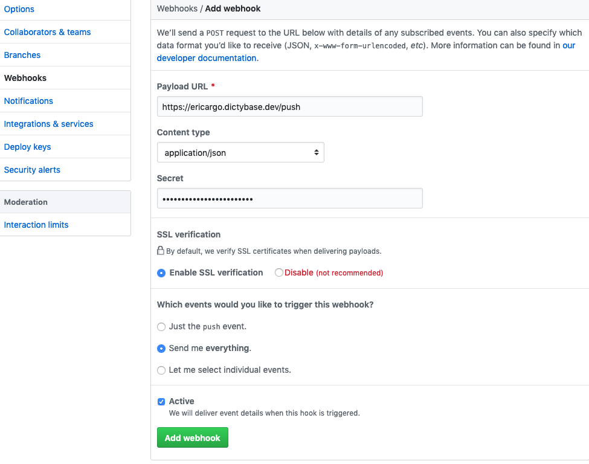

# Argo Events

Here we will go through the process of setting up Argo Events with a GitHub 
webhook in your cluster.

## Adding Argo and Argo Events

Make sure your account has the ability to create new clusterroles. See the 
[arangodb](./arangodb.md) guide for more information. Also the official Argo 
Events documentation can be found [here](https://argoproj.github.io/argo-events/).

#### Helm Chart

- Create namespaces


> `$_> kubectl create namespace argo`
> `$_> kubectl create namespace argo-events`

- Add `argoproj` repository


> `$_> helm repo add argo https://argoproj.github.io/argo-helm`

- Install `argo` chart


> `$_> helm install argo/argo --namespace argo`

- Install `argo-events` chart


> `$_> helm install argo/argo-events --namespace argo-events`

#### Generate Issuer and Certificate

You will need to create a new issuer and certificate for this namespace. 
Make sure you have `cert-manager` set up per [these instructions](./certificate.md).

__Issuer__
```yaml
apiVersion: certmanager.k8s.io/v1alpha1
kind: Issuer
metadata:
  name: argo-eric-dev
  namespace: argo-events
spec:
  acme:
    # The ACME server URL
    server: https://acme-v02.api.letsencrypt.org/directory
    # Email address used for ACME registration
    email: YOUR EMAIL HERE....
    # Name of a secret used to store the ACME account private key
    privateKeySecretRef:
      name: argo-eric-dev
    # Enable the HTTP-01 challenge provider
    http01: {}
```


> `$_> kubectl apply -f issuer.yml`

****
__Certificate__
```yaml
apiVersion: certmanager.k8s.io/v1alpha1
kind: Certificate
metadata:
  name: dictyargo-eric-dev
  namespace: argo-events
spec:
  secretName: argo-eric-dev-tls
  issuerRef:
    kind: Issuer
    name: argo-eric-dev
  dnsNames:
    - ericargo.dictybase.dev
  acme:
    config:
      - http01:
          ingressClass: nginx
        domains:
          - ericargo.dictybase.dev
```


> `$_> kubectl apply -f certificate.yaml`


#### Enable Ingress

Make ingress yaml file (`ingress-gh.yaml`)

```yaml
apiVersion: extensions/v1beta1
kind: Ingress
metadata:
  annotations:
    kubernetes.io/ingress.class: nginx
  name: github-gateway-svc
  namespace: argo-events
spec:
  rules:
  - host: ericargo.dictybase.dev
    http:
      paths:
      - backend:
          serviceName: github-gateway-svc
          servicePort: 12000
        path: /
  tls:
  - hosts:
    - ericargo.dictybase.dev
    secretName: argo-eric-dev-tls
```


>`$_> kubectl apply -f ingress-gh.yaml -n argo-events`

#### Enable GitHub Webhooks

Go to the GitHub repository of the project you want to use webhooks on, then 
click the Settings tab. In here, click on the Webhooks tab and then "Add webhook".

Here is an example of what your settings could look like.



Make sure content type is `application/json`.

For the secret, a helpful way to generate a new one is by using this command in 
the terminal: `ruby -rsecurerandom -e 'puts SecureRandom.hex(20)'`

Make note of this secret key -- you will need it shortly.

Also make note of the webhook ID. You can find this by clicking on the webhook 
once it has been created (it will be found at the end of the URL (i.e. `117799556`))

#### Generate personal access token

Now you need to generate a personal access token from GitHub. Go to your personal 
[settings page](https://github.com/settings/tokens). Click "Generate new token" 
then fill out the Note and select your desired scopes. Once complete, click 
"Generate token" at the bottom. **IMPORTANT: copy this token immediately.** You 
will need this for the next section.

#### Generate secret

You need to create a [Kubernetes secret](https://kubernetes.io/docs/concepts/configuration/secret/) 
with both your webhook token and personal access token. It is preferable to 
generate this via the command line. I ran into issues when using a YAML file 
where somehow foreign characters were being passed in, thereby creating 
verification problems.


>`$_> kubectl create secret generic github-access --from-literal=token=YOUR_TOKEN_HERE `
>                        `--from-literal=secret=YOUR_SECRET_HERE -n argo-events`

#### Deploy the gateway

Create a new yaml file (`github-gateway.yaml`).

```yaml
apiVersion: argoproj.io/v1alpha1
kind: Gateway
metadata:
  name: github-gateway
  labels:
    # gateway controller with instanceId "argo-events" will process this gateway
    gateways.argoproj.io/gateway-controller-instanceid: argo-events
    # gateway controller will use this label to match with its own version
    # do not remove
    argo-events-gateway-version: v0.10
spec:
  type: "github"
  eventSource: "github-event-source"
  processorPort: "9330"
  eventProtocol:
    type: "HTTP"
    http:
      port: "9300"
  template:
    metadata:
      name: "github-gateway"
      labels:
        gateway-name: "github-gateway"
    spec:
      containers:
        - name: "gateway-client"
          image: "argoproj/gateway-client"
          imagePullPolicy: "Always"
          command: ["/bin/gateway-client"]
        - name: "github-events"
          image: "argoproj/github-gateway"
          imagePullPolicy: "Always"
          command: ["/bin/github-gateway"]
      serviceAccountName: "argo-events-sa"
  service:
    metadata:
      name: github-gateway-svc
    spec:
      selector:
        gateway-name: "github-gateway"
      ports:
        - port: 12000
          targetPort: 12000
      type: LoadBalancer
  watchers:
    sensors:
      - name: "github-sensor"
```


>`$_> kubectl apply -f github-gateway.yaml -n argo-events`

#### Deploy the event source

Create a new yaml file (`github-event-source.yaml`).

```yaml
apiVersion: v1
kind: ConfigMap
metadata:
  name: github-event-source
  labels:
    # do not remove
    argo-events-event-source-version: v0.10
data:
  example: |-
    # id of the webhook
    id: 123
    # owner of the repo
    owner: "dictybase"
    # repository name
    repository: "test-repo"
    # Github will send events to the following port and endpoint
    hook:
     # endpoint to listen to events on
     endpoint: "/push"
     # port to run internal HTTP server on
     port: "12000"
     # url the gateway will use to register at Github.
     # This url must be reachable from outside the cluster.
     # The gateway pod is backed by the service defined in the gateway spec. So get the URL for that service Github can reach to.
     url: "https://ericargo.dictybase.dev"
    # type of events to listen to.
    # following listens to everything, hence *
    # You can find more info on https://developer.github.com/v3/activity/events/types/
    events:
    - "*"
    # apiToken refers to K8s secret that stores the github api token
    apiToken:
      # Name of the K8s secret that contains the access token
      name: github-access
      # Key within the K8s secret whose corresponding value (must be base64 encoded) is access token
      key: token
    # webHookSecret refers to K8s secret that stores the github hook secret
    webHookSecret:
      # Name of the K8s secret that contains the hook secret
      name: github-access
      # Key within the K8s secret whose corresponding value (must be base64 encoded) is hook secret
      key: secret
    # type of the connection between gateway and Github
    insecure: false
    # Determines if notifications are sent when the webhook is triggered
    active: true
    # The media type used to serialize the payloads
    contentType: "json"
```


>`$_> kubectl apply -f github-event-source.yaml -n argo-events`

#### Deploy the sensor

Next you need to deploy a sensor. This example is very simple -- it just uses the 
Docker Whalesay demo container to display the action pulled from the triggered 
GitHub webhook. This will need to be heavily updated for any real use cases.

Create a new yaml file (`github-sensor.yaml`).

```yaml
apiVersion: argoproj.io/v1alpha1
kind: Sensor
metadata:
  name: github-sensor
  labels:
    # sensor controller with instanceId "argo-events" will process this sensor
    sensors.argoproj.io/sensor-controller-instanceid: argo-events
    # sensor controller will use this label to match with its own version
    # do not remove
    argo-events-sensor-version: v0.10
spec:
  template:
    spec:
      containers:
        - name: "sensor"
          image: "argoproj/sensor"
          imagePullPolicy: Always
      serviceAccountName: argo-events-sa
  dependencies:
    # name matching event sensor
    - name: "github-gateway:example"
  eventProtocol:
    type: "HTTP"
    http:
      port: "9300"
  triggers:
    - template:
        name: github-workflow-trigger
        group: argoproj.io
        version: v1alpha1
        kind: Workflow
        source:
          inline: |
            apiVersion: argoproj.io/v1alpha1
            kind: Workflow
            metadata:
              generateName: github-
            spec:
              entrypoint: whalesay
              arguments:
                parameters:
                - name: message
                  # this is the value that should be overridden
                  value: no message
              templates:
              - name: whalesay
                inputs:
                  parameters:
                  - name: message
                container:
                  image: docker/whalesay:latest
                  command: [cowsay]
                  args: ["{{inputs.parameters.message}}"]
      resourceParameters:
        - src:
            event: "github-gateway:example"
            path: "action"
          dest: spec.arguments.parameters.0.value
```


>`$_> kubectl apply -f github-sensor.yaml -n argo-events`

Now you can test this out by creating issues, leaving comments, etc. inside of 
the GitHub repository you set up the webhook for.

You can browse usable GitHub Webhook events [here](https://developer.github.com/webhooks/).

For an example of a webhook payload response, check the webhook settings page of the 
repository you are using.