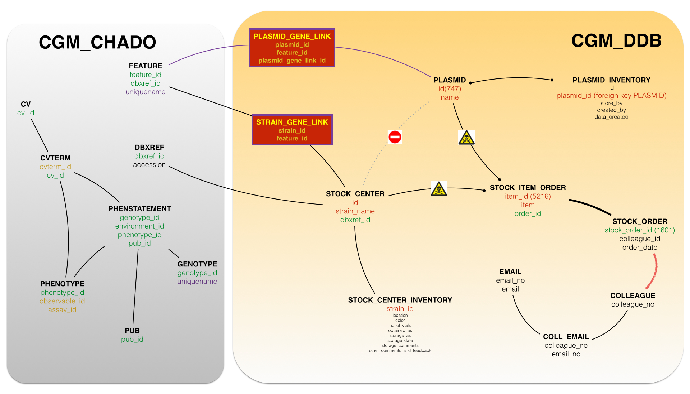

Stock Export: Data Validation
===

The following analysis was performed to ensure that the data exported using `modware-loader` is the same as the data retrieve from the database using `SQL` statements. The analysis is based on the counts of both the files and sql outputs.

The database snapshot used was `dictyfull_20150309.zip`. A different snapshot might get different counts than those summarized here.

The tables used to build the queries are summarized in the following figure:



## STRAINS

###### Files by Modware-loader

`perl -Ilib bin/modware-dump dictystrain -c config-legacy.yaml -d data/`

```shell
With SQL
      wc file
   19297 strain_characteristics.tsv
    1498 strain_genes.tsv
    6063 strain_genotype.tsv
    2468 strain_inventory.tsv
    7742 strain_phenotype.tsv
    6063 strain_strain.tsv

WITHOUT SQL
    5988 strain_publications.tsv (5448 unique DB_ids)
    1949 strain_publications_no_pubmed.tsv (1304 unique DB_ids)
   15317 strain_parent.tsv
    4626 strain_plasmid.tsv
   15098 strain_props.tsv
```

Summary basic stats:

- 6063 records in the `stock_center` table, with both unique `ID` and `DBXREF_ID`
- 5594 unique `stock_name`

###### SQL analysis

```sql
/* Strain (6063) -> strain_strain.tsv (6063) */
SELECT d.accession, sc.species, sc.strain_name, sc.strain_description
FROM CGM_DDB.stock_center sc
JOIN CGM_CHADO.dbxref d ON d.dbxref_id = sc.dbxref_id;
```

```sql
/* Strain inventory (2468) -> strain_inventory.tsv (2468) */
SELECT d.accession, sci.location, sci.color, sci.no_of_vials, sci.obtained_as, sci.stored_as, sci.storage_date, sci.storage_comments private_comment, sci.other_comments_and_feedback public_comment
FROM CGM_DDB.stock_center_inventory sci
JOIN CGM_DDB.stock_center sc ON sc.id = sci.strain_id
JOIN CGM_CHADO.dbxref d ON d.dbxref_id = sc.dbxref_id;
```

---

***Strain inventory notes***: 2468 inventory records, but there exist 1970 unique DBS_ID (which means that 498 records in the inventory are duplicates)

---

```sql
/* Strain publications (6063) -> strain_publications.tsv(5988), strain_publications_no_pubmed.tsv(1949) */
SELECT sc.strain_name, sc.pubmedid, sc.internal_db_id, sc.other_references
FROM CGM_DDB.stock_center sc;
```

---

***Strain publications notes***: 
- Database: 4,523 strains have pubmed references in the pubmedid column, which means that 1,540 do not have one.

- Exported to file `strain_publications.tsv`
  + 5988 annotations
  + 5448 unique DB_IDs (with a reference)
  + 1076 unique references (many duplications)
    * For example, the publication with PubmedID:17659086 appears 2258 times

---

```sql
/* Helpful SQL to explore bibliography */
SELECT sc.strain_name, sc.pubmedid, sc.internal_db_id, sc.other_references
FROM CGM_DDB.stock_center sc
WHERE sc.pubmedid is null AND (sc.OTHER_REFERENCES is not null AND REGEXP_LIKE(OTHER_REFERENCES, '^(d[0-9]{4}/)'))
```

```sql
/* Strain genotype (6063) -> strain_genotype.tsv */
SELECT d.accession, sc.strain_name, sc.genotype
FROM CGM_DDB.stock_center sc
JOIN CGM_CHADO.dbxref d ON d.dbxref_id = sc.dbxref_id;
```

---

```sql
/* Strain phenotype (6063) -> strain_phenotype.tsv (7742) */
SELECT sc.strain_name, sc.phenotype
FROM CGM_DDB.stock_center sc;
```

---

***Strain phenotype notes***: there are 1425 strains with phenotypes annotated in the database. However, the file `strain_phenotype.tsv` has 4,254 unique DB_ids, which means that strain phenotypes come from the following statement: 

```sql
/* Phenotype (7742) -> strain_phenotype.tsv */
SELECT g.uniquename dbs_id, phen.name phenotype, env.name environment, assay.name assay, pub.uniquename pmid, p.value phenotype_note
FROM phenstatement pst
LEFT JOIN genotype g on g.genotype_id = pst.genotype_id
LEFT JOIN cvterm env on env.cvterm_id = pst.environment_id
LEFT JOIN cv env_cv on env_cv.cv_id = env.cv_id
LEFT JOIN phenotype p on p.phenotype_id = pst.phenotype_id
LEFT JOIN cvterm phen on phen.cvterm_id = p.observable_id
LEFT JOIN cvterm assay on assay.cvterm_id = p.assay_id
LEFT JOIN cv assay_cv on assay_cv.cv_id = assay.cv_id
LEFT JOIN pub on pub.pub_id = pst.pub_id
ORDER BY g.uniquename, pub.uniquename, phen.name;
```

The statement is basically exporting the table `PHENSTATEMENT` (7742 elements), which is a linking table expressing the relationship between genotype, environment, and phenotype.

The questions are: 
* what is the relationship between the statement and the dicty stock center? 

Response: there is no direct relationship. It is just a list of phenotypes what we need to export. 

* Are these JOINs really necessary? 

```sql
LEFT JOIN cv env_cv on env_cv.cv_id = env.cv_id
LEFT JOIN cv assay_cv on assay_cv.cv_id = assay.cv_id
```

Response: They don't. They will be further removed.

---

```sql
/* Strain gene link (1498) -> strain_genes.tsv (1498) */
SELECT DISTINCT d.accession strain_id, d2.accession gene_id
FROM CGM_DDB.strain_gene_link sgl
JOIN CGM_DDB.stock_center sc ON sc.id = sgl.strain_id
JOIN CGM_CHADO.dbxref d ON d.dbxref_id = sc.dbxref_id
JOIN CGM_CHADO.feature f ON f.feature_id = sgl.feature_id
JOIN CGM_CHADO.dbxref d2 ON d2.dbxref_id = f.dbxref_id;
```

```sql
/* Strain characteristics (19297) -> strain_characteristics.tsv (19297)*/
SELECT DISTINCT d.accession, ct.name
FROM CGM_DDB.strain_char_cvterm scc
JOIN CGM_DDB.stock_center sc ON sc.id = scc.strain_id
JOIN CGM_CHADO.dbxref d ON d.dbxref_id = sc.dbxref_id
JOIN CGM_CHADO.cvterm ct ON ct.cvterm_id = scc.cvterm_id;
```

***Strain - Feature relationship***

The connection between `strains` and the `feature` table can be inferred from the `strain_genes.tsv` file.

Summary: the connection between strains, i.e. `stock_center` (6063 ids, 5594 distinct `strain_names`) and the table `feature` is through the table `strain_gene_link` (1498 with 1318 `strain_ids` and 525 `feature_id`, i.e., a strain might have many `feature_id` associated. In addition, a `feature_id` might have many strains associated). 

Although the table `stock_center` has a column `dbxref_id` that links to the table `dbxref`, and it could lead you to think that could be used to link it to the `feature` table, it is not possible because those `dbxref_id` coming from `stock_center` do not have a connection to the `feature` table. That's why the table `strain_gene_link` is necessary. 

```sql
SELECT  d.accession, d2.accession gene_id, f.UNIQUENAME
FROM CGM_DDB.stock_center sc
JOIN CGM_DDB.strain_gene_link sgl ON sc.id = sgl.strain_id
JOIN CGM_CHADO.dbxref d ON d.dbxref_id = sc.dbxref_id
JOIN CGM_CHADO.feature f ON f.feature_id = sgl.feature_id
JOIN CGM_CHADO.dbxref d2 ON d2.dbxref_id = f.dbxref_id
```

Output: 1498 records. 


## PLASMIDS

###### Files by Modware-loader

`perl -Ilib bin/modware-dump dictyplasmid -c config-legacy.yaml -d data/`

```shell
With SQL
      wc file
      50  plasmid_genbank.tsv
     531  plasmid_genes.tsv
     835  plasmid_inventory.tsv
     747  plasmid_plasmid.tsv

WITHOUT SQL
     3663  plasmid_props.tsv
     655  plasmid_publications.tsv
     456  plasmid_publications_no_pubmed.tsv  
```


```sql
/* Plasmid (747) -> plasmid_plasmid.tsv (747)*/
SELECT id, name, description
FROM CGM_DDB.plasmid;
```

```sql
/* Plasmid inventory (835) -> plasmid_inventory.tsv (835)*/
SELECT p.id, pi.location, pi.color, pi.stored_as, pi.storage_date, pi.other_comments_and_feedback public_comment
FROM CGM_DDB.plasmid p
JOIN CGM_DDB.plasmid_inventory pi ON p.id = pi.plasmid_id;
```

```sql
/* Plasmid gene link (531) -> plasmid_genes.tsv (531)*/
SELECT DISTINCT p.id plasmid_id, d.accession gene_id
FROM plasmid_gene_link pgl
JOIN CGM_DDB.plasmid p ON p.id = pgl.plasmid_id
JOIN CGM_CHADO.feature f ON f.feature_id = pgl.feature_id
JOIN CGM_CHADO.dbxref d ON d.dbxref_id = f.dbxref_id;
```

```sql
/* Plasmid - GenBank accession number (50) -> plasmid_genbank.tsv (50) */
SELECT id, genbank_accession_number
FROM CGM_DDB.plasmid
WHERE genbank_accession_number IS NOT NULL;
```

###### SQL for those without SQL statements (`publications, publications_no_pubmed, props`)

###### `plasmid_publications` (pubmedid)

***In file***
- 655 Number of publications in file
- 554 unique DBP_ID in file

***In database***

- 747 plasmids
  + 727 unique names (17 `names` are redundant)
  + 549 with pubmedids
  + 198 non pubmeids, with (9) nulls and  (189) has `spaces` in the pubmedid field.
    * 179 are non-redundant (an example of redundant plasmid with `spaces` is: `pDDB_G0295493-REMI`.

```sql
SELECT name
FROM CGM_DDB.plasmid
WHERE PUBMEDID IS NULL or
REGEXP_LIKE(pubmedid, '^ +$')
```

```sql
SELECT name, COUNT(*) AS REDUNDANT
FROM CGM_DDB.plasmid
WHERE PUBMEDID IS NULL or
REGEXP_LIKE(pubmedid, '^ +$')
GROUP BY NAME
ORDER BY REDUNDANT DESC
```

###### `plasmid_props.tsv`
It contains data for each plasmid of `depositor`, `synonymn`, and `keywords`, each of them in any line (3663). The specifics are:

- In file: 744 unique IDs
- In database: 747 plasmids
  + 726 have depositor
  + 506 have synonymn
  + 706 keywords
  + 477 have the three of them
  + 3 don't have the three of them

Conclusion: The file seems to be right.

```sql
SELECT depositor, synonymn, keywords 
FROM plasmid
```

## Stock Orders

```sql
/* Stock Center Orders(1978) - Plasmids (1978) */
SELECT so.stock_order_id order_id, so.order_date, plasmid.id, plasmid.name, colleague.colleague_no, colleague.first_name, colleague.last_name, email.email
FROM cgm_ddb.plasmid
JOIN cgm_ddb.stock_item_order sio on
(
  plasmid.id=sio.item_id
  and
  plasmid.name=sio.item
)
JOIN cgm_ddb.stock_order so on sio.order_id=so.stock_order_id
LEFT JOIN cgm_ddb.colleague on colleague.colleague_no=so.colleague_id
LEFT JOIN cgm_ddb.coll_email coe on coe.colleague_no=colleague.colleague_no
LEFT JOIN cgm_ddb.email on email.email_no=coe.email_no;
```

```sql
/* Stock Center Orders(3132) - Strains (3132) */
SELECT so.stock_order_id order_id, so.order_date, sc.id id, sc.strain_name name, colleague.colleague_no, colleague.first_name, colleague.last_name, email.email
FROM cgm_ddb.stock_center sc
JOIN cgm_ddb.stock_item_order sio on
(
  sc.id=sio.item_id
  AND
  sc.strain_name=sio.item
)
JOIN cgm_ddb.stock_order so on sio.order_id=so.stock_order_id
LEFT JOIN cgm_ddb.colleague on colleague.colleague_no=so.colleague_id
LEFT JOIN cgm_ddb.coll_email coe on coe.colleague_no=colleague.colleague_no
LEFT JOIN cgm_ddb.email on email.email_no=coe.email_no;
```
